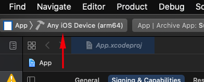
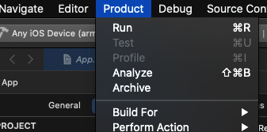
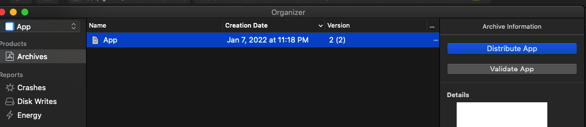

## Description
This is and PWA, IOS, and andriod (using capacitor) APP, to contribute to the project you need to clone the repository and follow the next steps.

## Content

- [Description](#description)
- [Content](#content)
  - [Get started](#get-started)
- [Frontend](#frontend)
- [Android](#android)
- [IOS](#ios)
  - [API entry point](#api-entry-point)
- [Frontend production](#frontend-production)
- [Backend](#backend)

### Get started 

**Requirements:**
- PHP 7.1.2 o superior
- Mysql 5.6
- NodeJs 10
- NPM 6.4
- Composer 1.8

---

## Frontend

```bash
git clone https://github.com/itsalb3rt/savycart-app.git
```

```bash
yarn install 
```

```bash
yarn serve
# or run the next command for production
yarn build
```

ℹ️ Don't forget to set up the API 👉 [https://github.com/itsalb3rt/sheiley-shop-api](https://github.com/itsalb3rt/sheiley-shop-api)


## Android

To run app in `Android mode`;

```bash
yarn serve:android
```

After the command is runny, the android studio will open and you can see the app in the emulator.


**Build**

```bash
yarn build:android
```

Run the following command in the `Android Studio` console, make a sure the terminal is in `src-capacitor/android` dir:

```
gradlew :app:bundleRelease
```

Now the **aab** file is on `src-capacitor\android\app\build\outputs\bundle\release`

Sign the **aab** file

```
jarsigner -verbose -sigalg SHA1withRSA -digestalg SHA1 -keystore ./secret/release-key.keystore ./src-capacitor/android/app/build/outputs/bundle/release/app-release.aab sheiley_shop_app
```

Enter the **Passpharese** for the keystore:

and now the **aab** file is ready to lunch in the store. :confetti_ball:

## IOS

To run app in `IOS mode`;

```bash
yarn serve:ios
```

After the command is runny, the xcode will open and you can see the app in the emulator.


**Build**

```bash
yarn build:ios
```

Remember in `src-capacitor` all the dependencies need to be installed.

After build is complete and the xcode is open, you need create archive from the app:

- Select the device, Any iOS Device




- Go to Product -> Archive



Now you get a archivo for distribution.



### API entry point

change the API entry pont in `env` file

```env
VUE_APP_API_DEV=http://localhost/sheiley_shop_api
VUE_APP_API_PRO=https://example.com/sheiley_shop_api
```

:tada: This is all you need to test it in your local environment!

## Frontend production


If you hosted the app in subdirectory go to `vue.config.js` and set the subdirectory name in `publicPath` property 

---

## Backend

Go to API repository [https://github.com/itsalb3rt/sheiley-shop-api](https://github.com/itsalb3rt/sheiley-shop-api)
