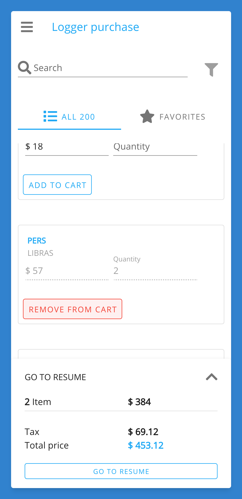
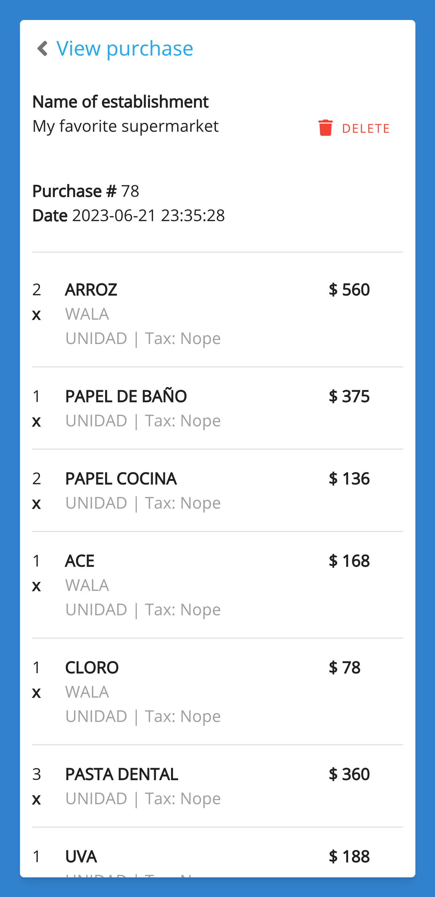

# SavyCart 

| Android | IOS

 

**SavyCart** is a **PWA** and **Android** APP to track personal purchases, No more paper and pencil to go to the supermarket :department_store:

Start now [Using the web version](https://sheiley-shop.netlify.app/) to track your purchases and save money :moneybag: 

---

 
 
 

---

### Features

- ✅ **Shopping History**: Access and review your shopping history, empowering you to make smarter decisions and analyze your spending patterns.
- ✅ **Accurate Unit of Measurement**: Specify the unit of measurement for each product, eliminating confusion and ensuring precise purchasing.
- ✅ **Expense Tracking**: Monitor and analyze your spending with detailed expense reports, providing valuable insights for better financial planning.
- ✅ **Synchronized Cloud Storage**: Safeguard your data with secure cloud storage, ensuring seamless synchronization across all your devices.

## Give a Star! ⭐

If you like this project or plan to use it in the future, please give it a star. Thanks 🙏

## Bugs and Feedback

For bugs, questions, and discussions, please use the [Github Issues](https://github.com/itsalb3rt/sheiley-shop-app/issues/new/choose) we have cool templates for you.

## Contributing

For contributing, please see the following links:

 - [Contribution Documents](./CONTRIBUTING.md)
 - [Contributors](https://github.com/itsalb3rt/sheiley-shop-app/contributors)

We're glad to be supported by respected companies and individuals from several industries. [See our Github Sponsors learn more](https://github.com/sponsors/itsalb3rt).

**Sponsors**

> [Become a Github Sponsor](https://github.com/sponsors/itsalb3rt)
